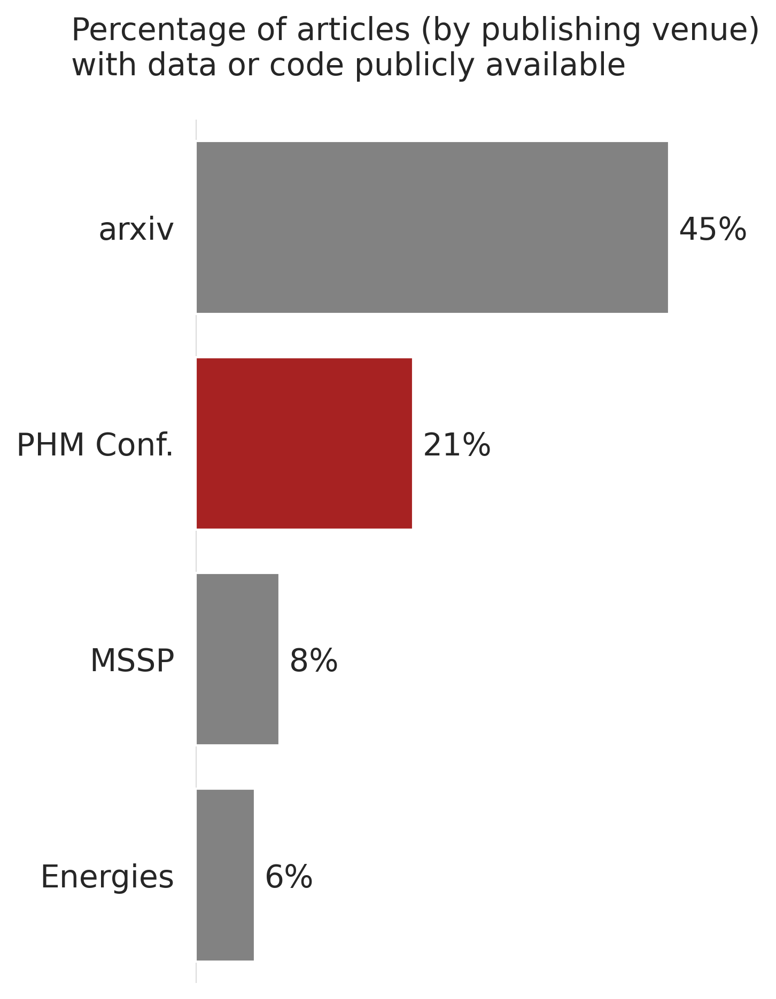
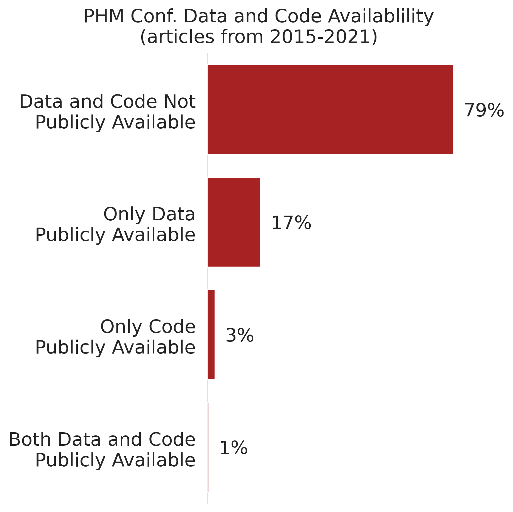

arxiv-code-search
==============================
 [![ci-cd]](https://github.com/tvhahn/arxiv-code-search/actions/workflows/main.yml/badge.svg)

Do authors on arXiv make their code and data available? We're building text mining and machine learning tools to find out!

Our goal is to build a system that can ingest arXiv papers, at scale, and automatically determine if the papers come with publicly available code or data. The *planned* design is as follows:

* Download paper meta-data from the [arXiv dataset](https://www.kaggle.com/datasets/Cornell-University/arxiv) and select papers by categories etc. ✔️ (complete)

* Download selected papers from arXiv ✔️ (complete)

* Label system to manually label paragraphs from papers ✔️ (complete)

  * Convert pdfs to text files.
  * Search text files for keywords and extract the paragraphs that contain the keywords
  * Save the paragraphs in a file that can be readily labeled

* Classifier for identifying papers that make their code or data available 🛠️ (in progress)

  * Use a BERT model, fine-tuned on the labeled paragraphs

This is active and preliminary research. **Stay tuned!**

### Preliminary Results
*  - Using the labeling system, we've manually labeled several thousand paragraphs (tedious work!). Here are some results from that. You can reproduce the figures in [colab](https://colab.research.google.com/github/tvhahn/arxiv-code-search/blob/master/notebooks/summarize_manual_labels.ipynb), or view the [notebook](https://github.com/tvhahn/arxiv-code-search/blob/master/notebooks/summarize_manual_labels.ipynb).

  
&nbsp; &nbsp; &nbsp; &nbsp;
  
&nbsp; &nbsp; &nbsp; &nbsp;

Project Organization
------------

    ├── LICENSE
    ├── Makefile           <- Makefile with commands like `make data` or `make train`
    ├── README.md          <- The top-level README for developers using this project.
    ├── data
    │   ├── external       <- Data from third party sources.
    │   ├── interim        <- Intermediate data that has been transformed.
    │   ├── processed      <- The final, canonical data sets for modeling.
    │   └── raw            <- The original, immutable data dump.
    │
    ├── docs               <- A default Sphinx project; see sphinx-doc.org for details
    │
    ├── models             <- Trained and serialized models, model predictions, or model summaries
    │
    ├── notebooks          <- Jupyter notebooks. Naming convention is a number (for ordering),
    │                         the creator's initials, and a short `-` delimited description, e.g.
    │                         `1.0-jqp-initial-data-exploration`.
    │
    ├── references         <- Data dictionaries, manuals, and all other explanatory materials.
    │
    ├── reports            <- Generated analysis as HTML, PDF, LaTeX, etc.
    │   └── figures        <- Generated graphics and figures to be used in reporting
    │
    ├── requirements.txt   <- The requirements file for reproducing the analysis environment, e.g.
    │                         generated with `pip freeze > requirements.txt`
    │
    ├── setup.py           <- makes project pip installable (pip install -e .) so src can be imported
    ├── src                <- Source code for use in this project.
    │   ├── __init__.py    <- Makes src a Python module
    │   │
    │   ├── data           <- Scripts to download or generate data
    │   │   └── make_dataset.py
    │   │
    │   ├── features       <- Scripts to turn raw data into features for modeling
    │   │   └── build_features.py
    │   │
    │   ├── models         <- Scripts to train models and then use trained models to make
    │   │   │                 predictions
    │   │   ├── predict_model.py
    │   │   └── train_model.py
    │   │
    │   └── visualization  <- Scripts to create exploratory and results oriented visualizations
    │       └── visualize.py
    │
    └── tox.ini            <- tox file with settings for running tox; see tox.readthedocs.io

--------
